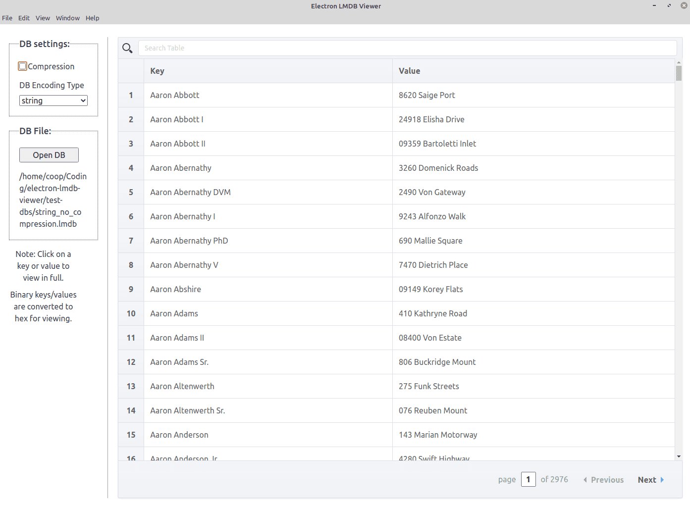

# electron-lmdb-viewer

This is a very bare-bones [LMDB](https://en.wikipedia.org/wiki/Lightning_Memory-Mapped_Database) database viewer. At the moment it only allows viewing the database keys and values - it doesn't currently allow you to delete/edit/add a key/value.

It uses [lmdb-store](https://www.npmjs.com/package/lmdb-store) under the hood.

#### Screenshot

#### Installation

1. `git clone https://github.com/Darkle/electron-lmdb-viewer.git && cd electron-lmdb-viewer`
2. `npm install`
3. `npx electron-rebuild` - this is to rebuild the `lmd-store` node bindings for electron
4. `npm start`

#### Alternatives

- https://github.com/cleve/lmdb-viewer
- https://fastonosql.com/
